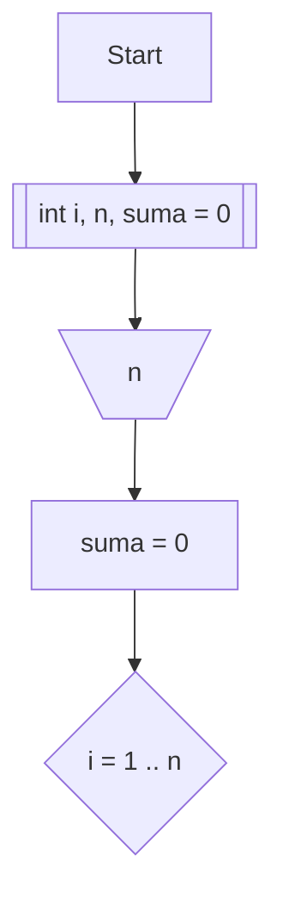

# Збир првих n бројева

## Задатак

Програм у програмском језику C који, за унето `n`, израчунава и исписује суму првих `n` бројева.

## Решење

```c
#define _CRT_SECURE_NO_WARNINGS
#include <stdio.h>
int main(void)
{	
	int n, s = 0;
	scanf("%d", &n);
	for(int i = 1; i <= n; i++)
		s += i;
	printf("%d", s);
    return 0;
}
```

## Алгоритам


